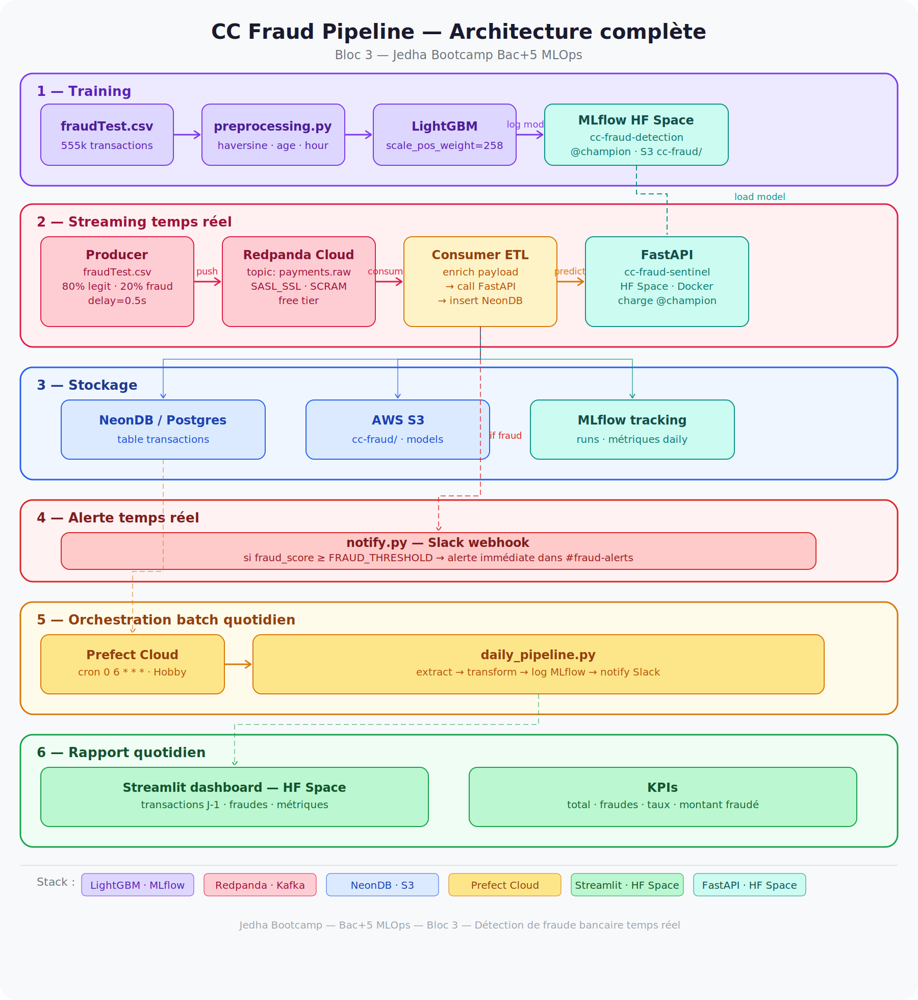

# CC Fraud Pipeline 🔍

Détection automatique en temps réel de transactions frauduleuses par carte bancaire.

Projet de certification **Bloc 3 — Concevoir et mettre en œuvre des pipelines de données**  
Jedha Bootcamp — Bac+5 MLOps

---

## Architecture



| Composant | Technologie | Rôle |
|---|---|---|
| Feature engineering | pandas · numpy | haversine, age, hour, day_of_week |
| Modèle | LightGBM | Classification binaire — scale_pos_weight=258 |
| Experiment tracking | MLflow (HF Space) | Runs, métriques, registry |
| Artifact store | AWS S3 | Modèles sérialisés |
| Inference API | FastAPI (HF Space) | Endpoint `/predict` — charge `@champion` |
| Message broker | Redpanda Cloud | Topic `payments.raw` |
| Consumer ETL | Python · kafka-python | Enrich → predict → insert |
| Base de données | NeonDB / Postgres | Table `transactions` |
| Alertes temps réel | Slack webhook | Notification si fraude détectée |
| Orchestration batch | Prefect Cloud | Flow quotidien 06:00 |
| Dashboard | Streamlit (HF Space) | Rapport J-1 |

---

## Dataset

**fraudTest.csv** — 555 719 transactions bancaires synthétiques  
Target : `is_fraud` — ratio 0.39% fraudes (déséquilibre géré via `scale_pos_weight=258`)

---

## Performances du modèle

| Métrique | Valeur |
|---|---|
| ROC-AUC | 0.9780 |
| PR-AUC | 0.8858 |
| F1 (fraude) | 0.7498 |
| Recall | 0.8834 |
| Precision | 0.6512 |

---

## Structure du projet

cc-fraud-pipeline/
│
├── data/                          # fraudTest.csv (ignoré par git)
├── notebooks/                     # EDA et entraînement
├── src/
│   ├── config.py                  # constantes partagées
│   ├── preprocessing.py           # feature engineering
│   ├── train.py                   # entraînement + MLflow
│   ├── mlflow_utils/              # tracking + registry
│   ├── api/                       # source de vérité FastAPI
│   ├── streaming/                 # producer + consumer Kafka
│   ├── db/                        # schema SQL + client Postgres
│   ├── alerts/                    # webhook Slack
│   ├── orchestration/             # Prefect daily pipeline
│   └── report/                    # Streamlit dashboard
└── tests/                         # tests unitaires

---

## Installation

```bash
git clone https://github.com/Ibra-Ba/cc-fraud-pipeline
cd cc-fraud-pipeline
python -m venv venv
source venv/bin/activate
pip install -r requirements.txt
```

Copier et renseigner les variables d'environnement :

```bash
cp .env.example .env
```

Variables requises :

```bash
# Redpanda
REDPANDA_BOOTSTRAP=
REDPANDA_USERNAME=
REDPANDA_PASSWORD=
REDPANDA_TOPIC=payments.raw

# NeonDB
DATABASE_URL=

# MLflow
MLFLOW_TRACKING_URI=
MLFLOW_TRACKING_USERNAME=
MLFLOW_TRACKING_PASSWORD=

# AWS S3
AWS_ACCESS_KEY_ID=
AWS_SECRET_ACCESS_KEY=
AWS_DEFAULT_REGION=

# Prefect
PREFECT_API_KEY=
PREFECT_API_URL=

# API
CC_FRAUD_API_URL=

# Alertes
SLACK_WEBHOOK_URL=
```

---

## Lancer le pipeline

### 1. Entraînement

```bash
make train
```

Puis promouvoir le modèle en champion :

```bash
python -c "from src.mlflow_utils.registry import promote_champion; promote_champion()"
```

### 2. Initialiser la base de données

```bash
python -c "
import psycopg2
from src.config import DATABASE_URL
with psycopg2.connect(DATABASE_URL) as conn:
    with conn.cursor() as cur:
        with open('src/db/schema.sql') as f:
            cur.execute(f.read())
    conn.commit()
    print('Table transactions créée.')
"
```

### 3. Déployer l'API

```bash
make deploy-api
```

API disponible sur : `https://VoxUp-cc-fraud-sentinel.hf.space`

### 4. Lancer le pipeline complet

Ouvrir 4 terminaux :

```bash
# Terminal 1 — Orchestration Prefect (batch quotidien 06:00)
make orchestrate

# Terminal 2 — Consumer ETL (écoute Kafka en continu)
make consume

# Terminal 3 — Producer (simule les paiements)
make produce

# Terminal 4 — Dashboard Streamlit
make report
```

### 5. Déclencher le batch manuellement

```bash
prefect deployment run 'cc-fraud-daily-pipeline/cc-fraud-daily-deployment'
```

---

## Services déployés

| Service | URL |
|---|---|
| Inference API | `https://VoxUp-cc-fraud-sentinel.hf.space` |
| API Docs | `https://VoxUp-cc-fraud-sentinel.hf.space/docs` |
| MLflow UI | `https://VoxUp-mlflow-server.hf.space` |
| Prefect Cloud | `https://app.prefect.cloud` |

---

## Objectifs business

| Objectif | Solution |
|---|---|
| Notification immédiate si fraude détectée | Consumer → `notify.py` → Slack webhook |
| Rapport quotidien des transactions J-1 | Prefect cron 06:00 → Streamlit dashboard |

---

## Améliorations possibles

- **Airflow sur HF Space** — orchestration cloud autonome sans dépendance machine locale
- **Tuning du seuil** `FRAUD_THRESHOLD` via courbe Precision-Recall
- **Feature store** — centraliser le preprocessing pour producer et API
- **Tests d'intégration** consumer → API → DB
- **Monitoring drift** — détecter la dérive du modèle sur les données réelles

---

## Auteur

ibrahim — Jedha Bootcamp Bac+5 MLOps — Bloc 3